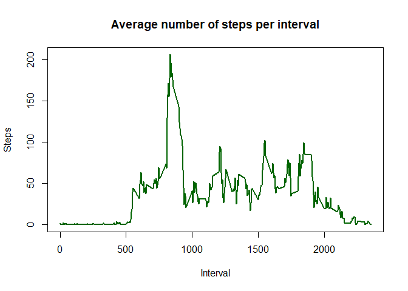
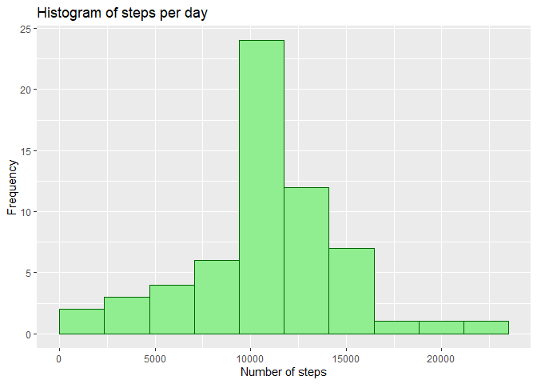
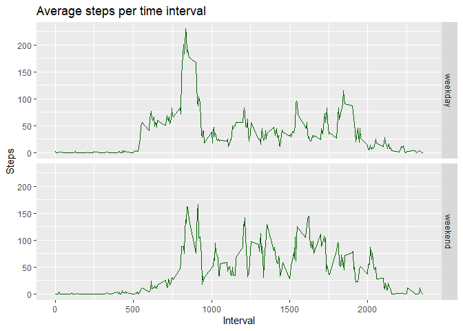

## Loading and preprocessing the data

1. Load the data and libraries

```r
activity <- read.csv("./data/activity.csv")
library(ggplot2)
library(dplyr)
```

```
## 
## Attaching package: 'dplyr'
```

```
## The following objects are masked from 'package:stats':
## 
##     filter, lag
```

```
## The following objects are masked from 'package:base':
## 
##     intersect, setdiff, setequal, union
```

2. Preprocessing the data and displaying the internal structure of the data frame

```r
activity$date <- as.Date(activity$date)
str(activity)
```

```
## 'data.frame':	17568 obs. of  3 variables:
##  $ steps   : int  NA NA NA NA NA NA NA NA NA NA ...
##  $ date    : Date, format: "2012-10-01" "2012-10-01" ...
##  $ interval: int  0 5 10 15 20 25 30 35 40 45 ...
```

```r
head(activity)
```

```
##   steps       date interval
## 1    NA 2012-10-01        0
## 2    NA 2012-10-01        5
## 3    NA 2012-10-01       10
## 4    NA 2012-10-01       15
## 5    NA 2012-10-01       20
## 6    NA 2012-10-01       25
```

## What is mean total number of steps taken per day?

1. Calculate the total number of steps taken per day

```r
steps_per_day <- aggregate(activity$steps,  list(activity$date), FUN=sum)
colnames(steps_per_day) <- c("date", "steps")
head(steps_per_day)
```

```
##         date steps
## 1 2012-10-01    NA
## 2 2012-10-02   126
## 3 2012-10-03 11352
## 4 2012-10-04 12116
## 5 2012-10-05 13294
## 6 2012-10-06 15420
```

2. Histogram of the total number of steps taken per day

```r
g1 <- ggplot(steps_per_day, aes(steps))
g1+geom_histogram(boundary=0, bins = 10, col="darkgreen", fill="lightgreen")+
    ggtitle("Histogram of steps per day")+
    xlab("Number of steps")+ylab("Frequency")
```

```
## Warning: Removed 8 rows containing non-finite values (stat_bin).
```

<!-- -->

3. Mean and median of the total number of steps taken per day

```r
mean(steps_per_day$steps, na.rm=TRUE)
```

```
## [1] 10766.19
```


```r
median(steps_per_day$steps, na.rm=TRUE)
```

```
## [1] 10765
```

## What is the average daily activity pattern?

1. Time series plot of the 5 minute interval and averaged number of steps taken averaged across all days 


```r
steps_per_interval <- aggregate(activity$steps,  list(activity$interval), FUN=mean, na.rm=TRUE)
colnames(steps_per_interval) <- c("interval", "steps")
plot(steps_per_interval$interval, steps_per_interval$steps,
     type = "l", col="darkgreen", lwd = 2, xlab="Interval",
     ylab="Steps", main="Average number of steps per interval")
```

<!-- -->

2. Interval with the maximum average number of steps

```r
steps_per_interval %>%  slice(which.max(steps))
```

```
##   interval    steps
## 1      835 206.1698
```


## Imputing missing values

1. Total number of missing values in the dataset

```r
sum(is.na(activity$steps))
```

```
## [1] 2304
```


2. Filling missing values in the dataset by the mean for that 5-minute interval

```r
steps_mean <- as.integer(round(steps_per_interval$steps[
    match(activity$interval, steps_per_interval$interval)],0))
activity_filled <- activity %>% 
    mutate(steps = if_else(is.na(steps), steps_mean, steps))
head(activity_filled)
```

```
##   steps       date interval
## 1     2 2012-10-01        0
## 2     0 2012-10-01        5
## 3     0 2012-10-01       10
## 4     0 2012-10-01       15
## 5     0 2012-10-01       20
## 6     2 2012-10-01       25
```

3. Calculate the total number of steps taken per day for the new dataset with the missing data filled in

```r
steps_per_day_filled <- aggregate(activity_filled$steps,  list(activity_filled$date), FUN=sum)
colnames(steps_per_day_filled) <- c("date", "steps")
head(steps_per_day_filled)
```

```
##         date steps
## 1 2012-10-01 10762
## 2 2012-10-02   126
## 3 2012-10-03 11352
## 4 2012-10-04 12116
## 5 2012-10-05 13294
## 6 2012-10-06 15420
```

4. Histogram of the total number of steps taken per day

```r
g2 <- ggplot(steps_per_day_filled, aes(steps))
g2+geom_histogram(boundary=0, bins = 10, col="darkgreen", fill="lightgreen")+
    ggtitle("Histogram of steps per day")+
    xlab("Number of steps")+ylab("Frequency")
```

<!-- -->

4. Mean and median of the total number of steps taken per day

```r
mean(steps_per_day_filled$steps)
```

```
## [1] 10765.64
```


```r
median(steps_per_day_filled$steps)
```

```
## [1] 10762
```

## Are there differences in activity patterns between weekdays and weekends?

1. Create a new factor variable in the dataset with two levels – “weekday” and “weekend”

```r
Sys.setlocale("LC_TIME", "English")
```

```
## [1] "English_United States.1252"
```

```r
weekday <- weekdays(activity_filled$date)
day_type <- ifelse(weekday=='Saturday' | weekday=='Sunday', 'weekend','weekday')
activity_filled$day_type <- as.factor(day_type)
head(activity_filled)
```

```
##   steps       date interval day_type
## 1     2 2012-10-01        0  weekday
## 2     0 2012-10-01        5  weekday
## 3     0 2012-10-01       10  weekday
## 4     0 2012-10-01       15  weekday
## 5     0 2012-10-01       20  weekday
## 6     2 2012-10-01       25  weekday
```

2. Create an auxiliary data frame with averaged number of steps

```r
steps_per_interval_day_type <-  aggregate(steps~interval+day_type,  
    data= activity_filled, FUN=mean)
colnames(steps_per_interval_day_type) <- 
    c("interval", "day_type", "steps")
head(steps_per_interval_day_type)
```

```
##   interval day_type      steps
## 1        0  weekday 2.28888889
## 2        5  weekday 0.40000000
## 3       10  weekday 0.15555556
## 4       15  weekday 0.17777778
## 5       20  weekday 0.08888889
## 6       25  weekday 1.57777778
```

3. Panel plot containing a time series plot of the 5 minute interval and averaged number of steps taken averaged with respect day type

```r
g3 <- ggplot(steps_per_interval_day_type, aes(interval, steps))
g3+geom_line(col="darkgreen")+
    ggtitle("Average steps per time interval")+
    xlab("Interval")+ylab("Steps")+
    facet_grid(day_type ~ .)
```

<!-- -->

